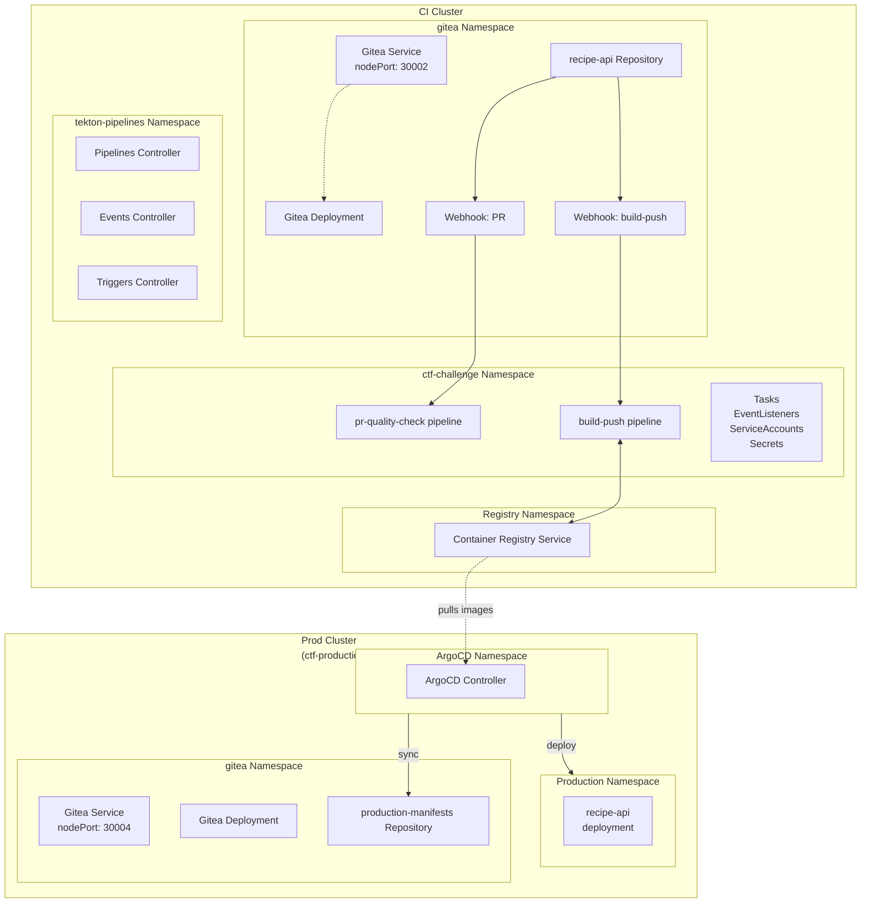

# Deep Dive Demo Setup Guide

This guide provides a fully automated setup for challenges 1-4, minimizing manual intervention for deep dive sessions.

## Quick Start (Fully Automated)

Run the complete automated setup with a single command:

```bash
make setup-demo
```

This will:
1. ✅ Create KinD cluster (CTF environment)
2. ✅ Install Gitea
3. ✅ Install Tekton Pipelines and Triggers
4. ✅ Setup local Docker registry with TLS
5. ✅ Configure registry TLS certificates
6. ✅ Seed legitimate base image (`golang:1.25-alpine`) to registry
7. ✅ Seed recipe-api repository to Gitea
8. ✅ Install Challenge 1 Tekton resources (vulnerable PR pipeline)
9. ✅ Install Challenge 2 Tekton resources (push build pipeline)
10. ✅ Create Gitea webhooks automatically via API
11. ✅ Trigger initial Challenge 2 build pipeline
12. ✅ Build recipe-api image locally (for production cluster)
13. ✅ Create production KinD cluster (Challenge 4)
14. ✅ Install production Gitea and ArgoCD (Challenge 4)
15. ✅ Seed production-manifests repository and deploy ArgoCD application
16. ✅ Verify all prerequisites are met

## Step-by-Step Setup (Manual Control)

If you prefer to run each step separately:

```bash
# 1. Core infrastructure
make setup

# 2. Configure registry TLS trust (interactive)
make configure-registry-tls

# 3. Seed base image for Challenge 3
make seed-legitimate-base-image

# 4. Setup Challenge 1 (PR Quality Check Attack)
make setup-ctf-challenge

# 5. Setup Challenge 2 (Container Layer Leak Attack)
make setup-challenge2-tekton

# 6. Setup Gitea webhooks (automated)
make setup-gitea-webhooks

# 7. Build recipe-api image locally (needed for Challenge 4)
make build-recipe-api

# 8. Setup Challenge 4 (GitOps Pipeline Compromise)
make setup-challenge4

# 9. Verify everything is ready
make verify-demo-readiness
```

## What Gets Automated

### Challenge 1: Pull Request Target Attack
- ✅ Vulnerable PR quality check pipeline
- ✅ Git clone task
- ✅ Quality check task (vulnerable to secret theft)
- ✅ EventListener for pull_request events
- ✅ Gitea webhook configured automatically
- ✅ CTF flag secret with registry credentials

### Challenge 2: Container Layer Leak Attack
- ✅ Push build pipeline
- ✅ Go application build task
- ✅ Container image build task (Kaniko)
- ✅ Container image push task
- ✅ EventListener for push events
- ✅ Gitea webhook configured automatically
- ✅ ServiceAccounts and RBAC
- ✅ Registry authentication secrets

### Challenge 3: Base Image Poisoning Attack
- ✅ Legitimate base image (`golang:1.25-alpine`) seeded to registry
- ✅ Registry credentials available (from Challenge 1)
- ✅ Pipeline configured to pull from local registry
- ℹ️ No additional resources needed (reuses Challenge 2 pipeline)

### Challenge 4: GitOps Pipeline Compromise
- ✅ Production KinD cluster created (`ctf-production-cluster`)
- ✅ Production Gitea installed (http://localhost:30004)
- ✅ ArgoCD installed with vulnerable RBAC
- ✅ recipe-api image loaded into production cluster
- ✅ `production-manifests` repository seeded
- ✅ ArgoCD application deployed and syncing

### Webhooks (Fully Automated)
The `setup-gitea-webhooks` script automatically creates webhooks via Gitea API:
- **PR Webhook**: Triggers Challenge 1 pipeline on pull_request events
- **Push Webhook**: Triggers Challenge 2 pipeline on push events

No manual webhook configuration in Gitea UI required!

## Access Information

After `make setup-demo` completes:

| Service | Cluster | URL | Username | Password |
|---------|---------|-----|----------|----------|
| Gitea | CTF | http://localhost:30002 | ctf-admin | CTFSecurePass123! |
| Registry | CTF | https://localhost:30000 | ctf-admin | CTFRegistryPass123! |
| Gitea (production) | Production | http://localhost:30004 | ctf-admin | CTFSecurePass123! |
| ArgoCD | Production | https://localhost:30443 | admin | admin123 |

## Verification

Check that everything is ready:

```bash
make verify-demo-readiness
```

This verifies:
- ✅ CTF cluster is running
- ✅ Gitea is accessible
- ✅ Registry is accessible
- ✅ Tekton is installed
- ✅ recipe-api repository exists
- ✅ All pipelines and tasks are deployed
- ✅ All EventListeners have services
- ✅ ServiceAccounts exist
- ✅ Webhooks are configured
- ✅ Secrets and ConfigMaps are created
- ✅ Base image `golang:1.25-alpine` in registry (Challenge 3)
- ✅ Production cluster running (Challenge 4)
- ✅ Production Gitea and ArgoCD accessible (Challenge 4)
- ✅ ArgoCD application deployed and syncing (Challenge 4)

## Starting the Deep Dive Session

Once setup is complete, you can start the demo immediately:

### Challenge 1: Pull Request Target Attack

1. Open Gitea: http://localhost:30002
2. Login as `ctf-admin` / `CTFSecurePass123!`
3. Go to `recipe-api` repository
4. Create a new branch and pull request with malicious code
5. Watch the pipeline run: `kubectl get pipelineruns -n ctf-challenge -w`
6. Follow the attack guide: [challenges/challenge1/CTF-CHALLENGE-GUIDE.md](challenges/challenge1/CTF-CHALLENGE-GUIDE.md)

### Challenge 2: Container Layer Leak Attack

1. Use registry credentials obtained from Challenge 1
2. Pull the recipe-api image from the registry
3. Extract git history from container layers
4. Find leaked secrets in git history
5. Follow the attack guide: [challenges/challenge2/CTF-CHALLENGE-GUIDE.md](challenges/challenge2/CTF-CHALLENGE-GUIDE.md)

### Challenge 3: Base Image Poisoning Attack

1. Use registry credentials obtained from Challenge 1
2. Create a poisoned base image with a backdoor
3. Push it to the registry, overwriting `golang:1.25-alpine`
4. Trigger a build pipeline to embed the malware
5. Follow the attack guide: [challenges/challenge3/CTF-CHALLENGE-GUIDE.md](challenges/challenge3/CTF-CHALLENGE-GUIDE.md)

### Challenge 4: GitOps Pipeline Compromise

1. Extract ArgoCD credentials from `.env.production` (found in Challenge 2)
2. Use the leaked token to access the production ArgoCD
3. Modify production manifests to inject malicious workloads
4. Observe malicious deployment via ArgoCD sync
5. Follow the attack guide: [challenges/challenge4/CTF-CHALLENGE-GUIDE.md](challenges/challenge4/CTF-CHALLENGE-GUIDE.md)

## Useful Commands

```bash
# Monitor all pipeline runs
kubectl get pipelineruns -n ctf-challenge -w

# View pipeline run logs (requires tkn CLI)
kubectl tkn pipelinerun logs -f -n ctf-challenge

# List all webhooks
curl -s -u ctf-admin:CTFSecurePass123! \
  http://localhost:30002/api/v1/repos/ctf-admin/recipe-api/hooks | jq

# Check EventListener services
kubectl get svc -n ctf-challenge | grep el-

# Check registry images
curl --cacert certs/registry.crt -u ctf-admin:CTFRegistryPass123! \
  https://localhost:30000/v2/_catalog | jq

# Switch between clusters
kubectl config use-context kind-ctf-cluster
kubectl config use-context kind-ctf-production-cluster

# Check ArgoCD application status (Challenge 4)
kubectl --context kind-ctf-production-cluster get applications -n argocd

# Check production deployments (Challenge 4)
kubectl --context kind-ctf-production-cluster get all -n production
```

## Troubleshooting

### Registry TLS Issues

If you see TLS certificate errors:

```bash
make configure-registry-tls
```

This interactive script will help you trust the self-signed certificate.

### Webhooks Not Triggering

1. Verify webhooks exist:
   ```bash
   curl -s -u ctf-admin:CTFSecurePass123! \
     http://localhost:30002/api/v1/repos/ctf-admin/recipe-api/hooks | jq
   ```

2. Re-create webhooks:
   ```bash
   make setup-gitea-webhooks
   ```

3. Check EventListener pods:
   ```bash
   kubectl get pods -n ctf-challenge | grep el-
   ```

### Pipeline Not Starting

1. Check EventListener logs:
   ```bash
   kubectl logs -n ctf-challenge -l eventlistener=pr-quality-check-listener
   kubectl logs -n ctf-challenge -l eventlistener=push-build-listener
   ```

2. Verify webhook secret matches:
   ```bash
   kubectl get secret github-webhook-secret -n ctf-challenge -o yaml
   ```

## Cleanup

Reset the environment:

```bash
# Delete CTF cluster and all resources
make clean

# Delete production cluster (Challenge 4)
make clean-challenge4
```

## Time Estimates

| Operation | Duration |
|-----------|----------|
| Full automated setup (`make setup-demo`) | ~10-15 minutes |
| Verification (`make verify-demo-readiness`) | ~10 seconds |
| Creating a single pipeline run | ~2-3 minutes |
| Complete Challenge 1 attack | ~10-15 minutes |
| Complete Challenge 2 attack | ~15-20 minutes |
| Complete Challenge 3 attack | ~10-15 minutes |
| Complete Challenge 4 attack | ~15-20 minutes |

## What's NOT Automated

The following require manual steps:
- Creating pull requests in Gitea (Challenge 1 attack)
- Pushing commits to main branch (Challenge 2 attack)
- Creating and pushing poisoned base image (Challenge 3 attack)
- Using leaked ArgoCD token to inject malicious manifests (Challenge 4 attack)
- Executing the actual attack payloads
- Applying security remediations

This is intentional - the demo requires showing the manual attack steps!

## Architecture Diagram

```
┌─────────────────────────────────────────────────────────────┐
│                 CTF Cluster (ctf-cluster)                   │
│                                                             │
│  ┌────────────┐      ┌──────────────┐     ┌─────────────┐   │
│  │   Gitea    │────▶│   Tekton     │───▶│  Registry   │   │
│  │  :30002    │      │  Pipelines   │     │   :30000    │   │
│  │            │      │              │     │  (TLS)      │   │
│  │  Webhooks: │      │  Challenge 1:│     │             │   │
│  │  • PR      │      │  PR Pipeline │     │  Images:    │   │
│  │  • Push    │      │              │     │  • recipe-  │   │
│  │            │      │  Challenge 2:│     │    api:v1.0 │   │
│  │  recipe-   │      │  Push Build  │     │  • golang:  │   │
│  │  api repo  │      │              │     │    1.25-    │   │
│  │ (.env leak)│      │  Challenge 3:│     │    alpine   │   │
│  └────────────┘      │  (reuses C2) │     └─────────────┘   │
│                      └──────────────┘                       │
│  Namespace: ctf-challenge                                   │
│  • EventListeners, ServiceAccounts, Secrets                 │
└─────────────────────────────────────────────────────────────┘

┌─────────────────────────────────────────────────────────────┐
│            Production Cluster (ctf-production-cluster)      │
│                                                             │
│  ┌────────────┐      ┌──────────────┐     ┌─────────────┐   │
│  │ Gitea      │◀────│   ArgoCD     │───▶│ Production  │   │
│  │ :30004     │ sync │  :30443      │     │ Namespace   │   │
│  │            │      │              │     │             │   │
│  │ production-│      │ Vulnerable   │     │ recipe-api  │   │
│  │ manifests  │      │ RBAC         │     │ deployment  │   │
│  │ repo       │      │ (cluster-    │     │             │   │
│  │            │      │  admin)      │     │             │   │
│  └────────────┘      └──────────────┘     └─────────────┘   │
│                                                             │
│  Challenge 4: Attacker uses leaked ArgoCD token to inject   │
│  malicious manifests via production Gitea                   │
└─────────────────────────────────────────────────────────────┘
```

### Mermaid Diagram



## Next Steps

After completing the automated setup:

1. ✅ Review [challenges/challenge1/ATTACK-ANALYSIS.md](challenges/challenge1/ATTACK-ANALYSIS.md)
2. ✅ Review [challenges/challenge2/ATTACK-ANALYSIS.md](challenges/challenge2/ATTACK-ANALYSIS.md)
3. ✅ Review [challenges/challenge3/ATTACK-ANALYSIS.md](challenges/challenge3/ATTACK-ANALYSIS.md)
4. ✅ Review [challenges/challenge4/ATTACK-ANALYSIS.md](challenges/challenge4/ATTACK-ANALYSIS.md)
5. ✅ Prepare demo materials
6. ✅ Test the attacks once
7. ✅ Ready for deep dive session!
